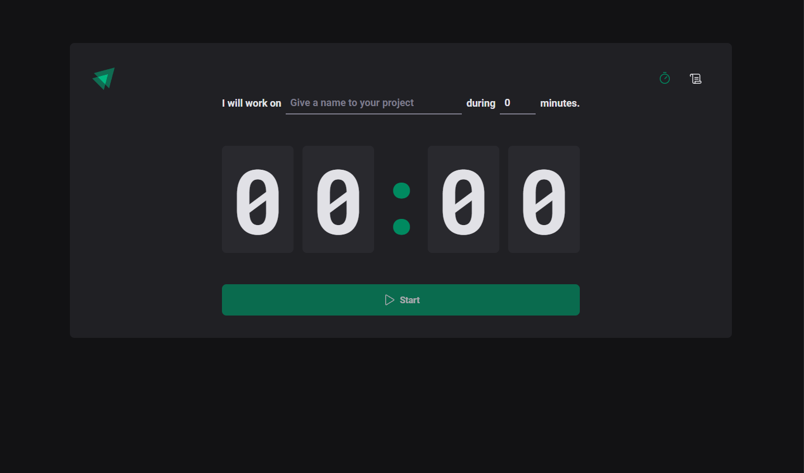

<h1 align="center">
    
</h1>

<p align="center">
  <a href="#-project">Project</a>&nbsp;&nbsp;&nbsp;|&nbsp;&nbsp;&nbsp;
  <a href="#-technologies">Technologies</a>&nbsp;&nbsp;&nbsp;|&nbsp;&nbsp;&nbsp;
  <a href="#-how-to-run">How to run</a>
</p>

<p align="center">
  
</p>

## 💻 Project

Pomodoro timer developed during Rocketseat's Ignite using classic <b>React Page Routing</b>, <b>React Hook Form</b>, <b>Themes</b> with <b>Styled Components</b> and state management with <b>Context API</b> and <b>Reducer</b> hooks.

## 🔧 Technologies

- [React.js](https://react.dev/)
- [React Hook Form](https://www.react-hook-form.com/)
- [Zod](https://zod.dev/)
- [Styled Components](https://styled-components.com/)
- [Phosphor Icons](https://phosphoricons.com/)
- [Date-fns](https://date-fns.org/)

## 😊 How to run

Before starting, you need to have [Git](https://git-scm.com) and [Node](https://nodejs.org/en/) installed on your machine.

```sh
- Clone this repo:
$ git clone https://github.com/marcelopajr/ignite-timer.git

- Enter directory:
$ cd ignite-timer

- Install dependencies:
$ npm install

- Launch the app:
$ npm run dev
```

Have fun!
